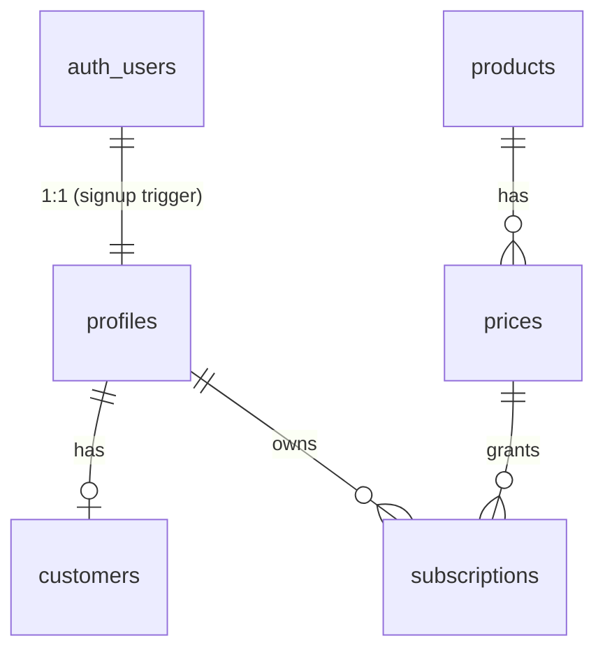
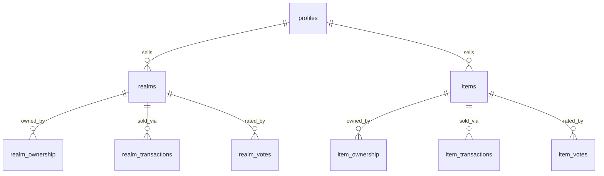

# Supabase Shared Services — Baseline Design

Status: **scaffolded, not provisioned.** Branch: `feat/supabase-shared-services`.
This document is the design + the exact steps to take it live. Nothing here has
touched a live cloud project, Stripe, or any billed resource.

## 1. Goal

Stand up a shared **Supabase (Postgres)** backend that holds the two things a
local-first desktop app cannot keep per-install:

- **Domain A — Paid user:** account/identity, subscription + entitlement, billing state.
- **Domain B — Marketplace:** shareable realms & items, ownership, transactions, votes.

Everything else in the app (server runtime, backups, telemetry, automations,
P2P RealmSync, players) stays in the existing **local SQLite** DB, unchanged.

## 2. Decisions (all confirmed with Jimmy)

| Fork | Decision |
|------|----------|
| Auth model | **Supabase Auth** (email/password + Discord OAuth). RLS keys off `auth.uid()`. |
| DB topology | **Separate cloud DB.** Supabase holds only identity/billing/marketplace; SQLite keeps all runtime. |
| Subscription billing | **Stripe** (Checkout + Customer Portal + webhooks → entitlement). |
| Marketplace transactions | **Free + full ownership/transaction tracking** at baseline. Price columns exist (default 0); paid is a later flip. |
| User migration | **None** — greenfield; nobody is on the app yet. No bcrypt import, no legacy onboarding. |
| Realms vs items | **Separate tables** (`realms`, `items`) — and per-type ownership/transactions/votes. |

## 3. Architecture — two databases, one trusted edge

The single most important constraint: **the Next.js "server" is embedded in the
Electron desktop app and runs on the end user's machine** (`electron/main.js`
launches the standalone Next server locally; `src/lib/db.ts` instantiates Prisma
there). There is **no trusted server today.**

Consequences:

- The desktop app **must not hold** the Supabase `service_role` key or a direct
  Postgres connection string — a user could extract them and read/write everyone's
  data. The app reaches the cloud **only** via `@supabase/supabase-js` using the
  **anon key + the signed-in user's JWT**, and **RLS is the real access boundary.**
- Anything that must be trusted (Stripe webhooks, minting paid ownership) runs in
  **Supabase Edge Functions** (Deno), which hold the secrets server-side. Edge
  Functions use `service_role`, which bypasses RLS by design.

```
Desktop app (Electron + Next, on user's machine)
  ├── local SQLite  ──►  Prisma (src/generated/client)      [runtime state]
  └── @supabase/supabase-js (anon key + user JWT, RLS)  ──►  Supabase Postgres
                                                               ▲
Stripe ──► Edge Function: stripe-webhook (service_role)  ──────┘  [billing writes]
Desktop app ──► Edge Function: create-checkout-session (user JWT) ──► Stripe Checkout
```

The existing local `Subscription` and `MarketplaceTemplate` tables can remain as a
**read-through cache** during transition; nothing is ripped out by this baseline.

## 4. Domain A — paid user (identity, billing, entitlement)

Source of truth for DDL + RLS: `supabase/migrations/20260707120000_init_shared_services.sql`.

| Table / view | Purpose | Key columns |
|---|---|---|
| `profiles` | App identity, 1:1 with `auth.users` | `id → auth.users`, `display_name`, `discord_id`, `role` (USER/ADMIN) |
| `customers` | Profile → Stripe customer | `id → profiles`, `stripe_customer_id` |
| `products` | Mirror of Stripe products | `id` (prod_…), `active`, `name` |
| `prices` | Mirror of Stripe prices + plan mapping | `id` (price_…), `product_id`, `unit_amount`, `interval`, `plan`, `active_slots` |
| `subscriptions` | Stripe subscription state = **entitlement source of truth** | `id` (sub_…), `user_id`, `status`, `price_id`, `plan`, `active_slots`, `current_period_end` |
| `stripe_events` | Webhook idempotency log | `id` (evt_…), `type`, `payload` |
| `user_entitlements` (view) | Single read surface: "what has this user paid for?" | one active row per user, highest `active_slots` |



**Entitlement flow:** Stripe → `stripe-webhook` Edge Function → upserts
`customers`/`subscriptions` with `plan`+`active_slots` derived from the price →
app reads `user_entitlements`. This finally makes `activeSlots` real: today it is
hardcoded to `999` at registration (`src/app/api/auth/register/route.ts`) and never
enforced (the slot check in `src/app/api/servers/route.ts` is only a comment). The
enforcement point (app-side, a later phase) is server creation and template deploy.

## 5. Domain B — marketplace (shared content, ownership, transactions)

Source of truth: `supabase/migrations/20260707120001_marketplace.sql`.

Realms and items are **separate tables** (different payloads: a realm is a full
world/server = `TemplatePayload` + optional `GameDefinitionSpec`; an item is a
smaller good — mod / modpack / config preset / asset). Ownership, transactions, and
votes are per-type for clean FKs and simple RLS.

| Table | Purpose |
|---|---|
| `realms` | Full shareable world/server. `payload jsonb`, `custom_def_spec jsonb`, `price_cents`, `visibility`, `status`, `verified_level`, counters |
| `items` | Smaller à-la-carte good. `item_type`, `payload jsonb`, same commerce/moderation columns |
| `realm_ownership` / `item_ownership` | Who acquired what. `acquired_via` (FREE/PURCHASE/GRANT/AUTHOR), `transaction_id` |
| `realm_transactions` / `item_transactions` | Every acquisition, free or paid. `amount_cents`, `type`, `status`, `stripe_payment_intent_id` |
| `realm_votes` / `item_votes` | LIKE=+1 / DISLIKE=−1; unique per (listing,user); counts denormalized on the parent via trigger |



**Acquisition** is via `SECURITY DEFINER` RPCs `acquire_realm(uuid)` /
`acquire_item(uuid)`: they atomically write a transaction + ownership row and bump
`download_count`, are idempotent per (listing,user), and **reject paid listings**
so money always flows through Stripe. Clients cannot insert ownership/transactions
directly; the paid path will run through an Edge Function using `service_role`.

The existing `MarketplaceTemplate.payload` shape (`src/lib/templates/types.ts`:
`TemplatePayload = { version, mods[], configOverrides[], startupParams }`) maps
directly onto `realms.payload`. The publish-time secret stripping in
`src/app/api/marketplace/publish/route.ts` must be re-implemented server-side (Edge
Function or DB trigger) before listings are allowed to reach `status = PUBLISHED`.

## 6. Auth model + identity bridge

- `auth.users` (Supabase Auth) is the identity source of truth: **email/password +
  Discord OAuth** (native provider — replaces the legacy 6-digit `DiscordLinkCode`
  exchange in `src/app/api/user/discord-link/route.ts`; the Discord numeric id is
  captured into `profiles.discord_id` by the `handle_new_user()` signup trigger).
- The desktop app swaps its custom `gv_session` HS256 cookie (`src/lib/auth.ts`) for
  a **Supabase session** (access + refresh) stored in Electron `safeStorage`. The
  local `User` row becomes a cache keyed by the Supabase `uid`. *(Client rewiring is
  a later implementation phase; this baseline scaffolds the backend.)*
- **Security note:** `src/lib/auth.ts` currently ships a hardcoded `JWT_SECRET`
  fallback (`"realmswap_secret_fallback_key_123"`). Moving to Supabase Auth retires
  that risk entirely.

## 7. Row Level Security approach

Every table has RLS **enabled** (verified: 14/14 tables, 26 policies). Keys off
`auth.uid()`; admin via an `is_admin()` SQL helper reading `profiles.role`.

| Table(s) | Read | Write |
|---|---|---|
| `profiles` | any authenticated (to show seller names) | own row, **only `display_name`/`discord_id`** (role locked via column grant) |
| `customers`, `subscriptions` | own row | **service_role only** (billing is never client-trusted) |
| `products`, `prices` | public, active rows | service_role only |
| `stripe_events` | — | service_role only (no policies) |
| `realms`, `items` | published+public/unlisted, OR own, OR admin | insert/update/delete own; `verified_level` + counters locked via column grants |
| `*_ownership` | own (or admin) | via `acquire_*` RPC / service_role only |
| `*_transactions` | own purchases + own sales (or admin) | via `acquire_*` RPC / service_role only |
| `*_votes` | own | full CRUD own; counts maintained by `SECURITY DEFINER` trigger |

Hardening beyond plain RLS: **column-level grants** stop sellers from self-awarding
`verified_level` or inflating `download_count`/`like_count`; those are set by admin
tooling / triggers respectively. Counter and acquisition logic run in
`SECURITY DEFINER` functions so clients never touch the locked columns directly.

## 8. Prisma's role in the cloud

Because the app can't ship a privileged Postgres connection, **`@supabase/supabase-js`
is the in-app cloud client.** The Prisma cloud schema
(`prisma/cloud/schema.prisma`, generates `src/generated/cloud-client`) exists for
**typed tooling / tests / admin scripts only — never shipped with secrets.**

- **Source of truth for the cloud DDL + RLS is the Supabase SQL migrations.** The
  Prisma cloud schema is kept in sync **from** them via
  `prisma db pull --schema prisma/cloud/schema.prisma` after the project exists
  (this avoids the Prisma-Migrate-vs-Supabase-migrations conflict).
- No extra Prisma query-engine binary is needed for the cloud in-app path (it's
  HTTP via supabase-js), so the existing `query-engine-windows.exe` bundling for
  local SQLite is untouched.

## 9. Environment variables

Added to `.env.example` as **placeholders** (never commit real values):

| Var | Where used | Secret? |
|---|---|---|
| `NEXT_PUBLIC_SUPABASE_URL` | app | public |
| `NEXT_PUBLIC_SUPABASE_ANON_KEY` | app | public (RLS-gated) |
| `SUPABASE_SERVICE_ROLE_KEY` | Edge Functions / tooling | **secret — never in app** |
| `SUPABASE_PROJECT_REF` | CLI / tooling | low |
| `SUPABASE_DB_URL` / `SUPABASE_DB_DIRECT_URL` | Prisma tooling | **secret — never in app** |
| `SUPABASE_AUTH_DISCORD_CLIENT_ID` / `_SECRET` | Auth provider | secret |
| `NEXT_PUBLIC_STRIPE_PUBLISHABLE_KEY` | app | public |
| `STRIPE_SECRET_KEY` | Edge Functions | **secret** |
| `STRIPE_WEBHOOK_SECRET` | `stripe-webhook` fn | **secret** |
| `STRIPE_PRICE_STARTER` / `_PARTY` / `_GUILD` | catalogue | low |

## 10. What's scaffolded vs. what still needs work

**Scaffolded (this branch, validated):**
- `supabase/config.toml` — local stack config (hand-authored; `supabase init` reconciles).
- `supabase/migrations/20260707120000_init_shared_services.sql` — Domain A + RLS + triggers.
- `supabase/migrations/20260707120001_marketplace.sql` — Domain B + RLS + counter triggers + acquire RPCs.
- `supabase/seed.sql` — STARTER/PARTY/GUILD catalogue (placeholder Stripe ids).
- `supabase/functions/stripe-webhook/` — trusted billing writer skeleton.
- `supabase/functions/create-checkout-session/` — checkout session creator skeleton.
- `prisma/cloud/schema.prisma` — typed cloud client (validated ✅).
- `.env.example` — cloud + Stripe placeholders.

**Not done — needs Jimmy / a later phase:**
- Provisioning the live project + Stripe + Discord app (see §12; requires login/billing).
- App client rewiring: add `@supabase/supabase-js`, session storage in Electron,
  swap `src/lib/auth.ts`, read `user_entitlements`, marketplace reads/writes, and
  **enforce `active_slots`** at server creation / template deploy.
- Server-side publish validation (secret stripping) before `status = PUBLISHED`.
- Edge Function hardening (retries, more Stripe event types, catalogue auto-sync).

## 11. Windows notes (repo targets Windows; scaffolded on macOS)

- Local Supabase dev (`supabase start`, `supabase db reset`) requires **Docker
  Desktop** running. Install the CLI via `scoop install supabase` or `npm i -g supabase`.
- Edge Functions run on Supabase (Deno) — no Windows toolchain needed.
- The in-app cloud path is HTTP (supabase-js), so **no new native binary** ships on
  Windows; local SQLite Prisma bundling is unchanged.
- Deep-link redirect uses the `realmsync://` protocol already registered in
  `electron/main.js` — reuse it for the OAuth/checkout callback.

## 12. Go-live checklist (run by Jimmy — spends money / creates cloud resources)

> ⚠️ None of this has been run. It is the exact path from this scaffold to live.

**Prereqs:** Node, Docker Desktop (Windows), Supabase CLI, a Stripe account, a
Discord developer application.

1. `supabase login` (opens browser).
2. Create the project (dashboard or `supabase projects create realmswap --region <region> --org-id <org> --db-password <STRONG_PW>`). **Capture:** Project Ref, anon key, service_role key, DB password, pooled + direct DB URLs.
3. `supabase link --project-ref <ref>`.
4. `supabase db push` to apply `supabase/migrations/*`. (Optionally `supabase start` + `supabase db reset` first to dry-run against the local stack.)
5. **Auth → Discord:** create a Discord OAuth app, set its redirect to `https://<ref>.supabase.co/auth/v1/callback`; in Supabase dashboard → Authentication → Providers → Discord, paste client id/secret and enable. Add `realmsync://auth-callback` to allowed redirect URLs; set Site URL.
6. **Stripe:** create products + prices for STARTER/PARTY/GUILD (test mode). Put `plan` and `active_slots` in each price's metadata (or update `public.prices`). Copy the secret + publishable keys.
7. Set function secrets: `supabase secrets set STRIPE_SECRET_KEY=sk_... STRIPE_WEBHOOK_SECRET=whsec_...` (Supabase injects `SUPABASE_URL` / `SUPABASE_SERVICE_ROLE_KEY` / `SUPABASE_ANON_KEY` automatically).
8. Deploy functions: `supabase functions deploy stripe-webhook --no-verify-jwt` and `supabase functions deploy create-checkout-session`.
9. **Stripe webhook:** add endpoint `https://<ref>.functions.supabase.co/stripe-webhook`, subscribe to `checkout.session.completed` + `customer.subscription.created/updated/deleted`, copy the signing secret and re-run `supabase secrets set STRIPE_WEBHOOK_SECRET=whsec_...`.
10. Seed the catalogue with real price ids (edit `supabase/seed.sql`, run it) or rely on webhook catalogue sync (once implemented).
11. Fill real values into a local `.env` (never commit). Run `prisma db pull --schema prisma/cloud/schema.prisma` + `prisma generate --schema prisma/cloud/schema.prisma` to refresh the typed client.
12. App phase: wire `@supabase/supabase-js`, swap auth, enforce entitlement, wire marketplace.

**Credentials needed:** Supabase (project ref, anon key, service_role key, DB
password, DB URLs) · Discord OAuth (client id + secret) · Stripe (secret key,
publishable key, webhook signing secret, 3 price ids).

## 13. Open decisions (non-blocking)

- Keep local `Subscription` / `MarketplaceTemplate` as caches, or drop them after cutover?
- Region / data residency for the Supabase project.
- Offline entitlement: live reads now; optional cloud→local mirror for offline gating later (the "sync a read subset down" variant we deferred).
- When to enable **paid** marketplace (flip `price_cents` + wire item Checkout), and whether creator payouts (Stripe Connect) are ever in scope.
- Rate-limiting / abuse controls on free acquisition and votes.

## 14. How this was validated locally

- `prisma validate` + `prisma format` on `prisma/cloud/schema.prisma` → **valid**.
- Both SQL migrations + seed applied against an ephemeral **Postgres 15** (Supabase
  `auth`/roles stubbed): 14 tables (all RLS-enabled), 26 policies, 4 functions, 3
  prices, `user_entitlements` view — **all applied cleanly.** (Caught and fixed one
  real ordering bug: `is_admin()` defined before `profiles`.)
- Functional tests passed: signup trigger creates profile + extracts `discord_id`;
  `acquire_realm` writes ownership+transaction and bumps downloads; acquisition is
  idempotent; vote-count trigger tracks like/dislike flips; paid realms are rejected
  by the free RPC.

No live cloud project, Stripe resource, or `supabase login` was involved.
